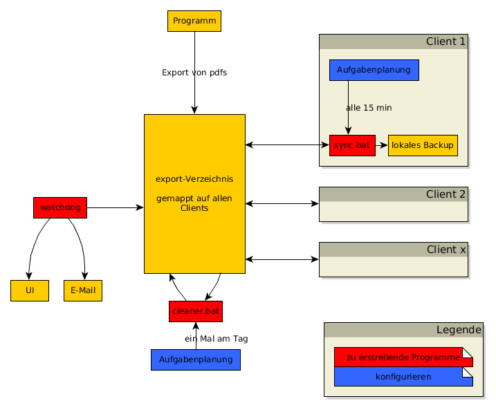

# Problemstellung

Informationen eines Programms das im Netzwerk arbeitet sollen vorhanden sein,
auch wenn das Netzwerk gestört oder ausgefallen ist. 

* Programm exportiert Informationen in PDFs in ein Verzeichnis
* 5-10 Clients (im Netzwerk) sollen Zugriff auf die PDFs haben
* dazu soll jeder Client das zentrale Verzeichnis synchronisieren (15-30 min reichen aus)
* Zentrales Verzeichnis soll nur Daten der letzten 3-5 Tage beinhalten
* Ausführung der Sync-Jobs soll überwachbar sein

# Context

* Clients laufen auf Win7
* Server läuft auf irgendeinem Win-Server-OS

# Installation

Zur Zeit müssen nur die Scripte an die entsprechenden stellen gelegt werden
und die Ausführung über die Aufgabenplanung in Windows eingesetllt werden.
In den Scripten selbst müssen natürlich die Pfade an die wirklichen
gegenbenheiten angepasst werden.

# Verzeichnisse

* doc
  * längere Doku die hier nicht rein passt
  * Bilder (werden mit yEd erstellt)
  
* scripts
  * Scripte zum Ausführen

# Teilprobleme und Hilfestellungen

## Dateien zählen
* https://stackoverflow.com/questions/11004045/batch-file-counting-number-of-files-in-folder-and-storing-in-a-variable

## unter Win7 Script in regelmäßigem Abstand ausführen

* https://stackoverflow.com/questions/4249542/windows-scheduler-to-run-a-task-every-x-minutes

## schwarzes Fenster soll nicht sichtbar sein

* https://www.howtogeek.com/tips/how-to-run-a-scheduled-task-without-a-command-window-appearing/
* gibt eventuell Probleme mit dem gemappten Laufwerk -> muss man mal ausprobieren
